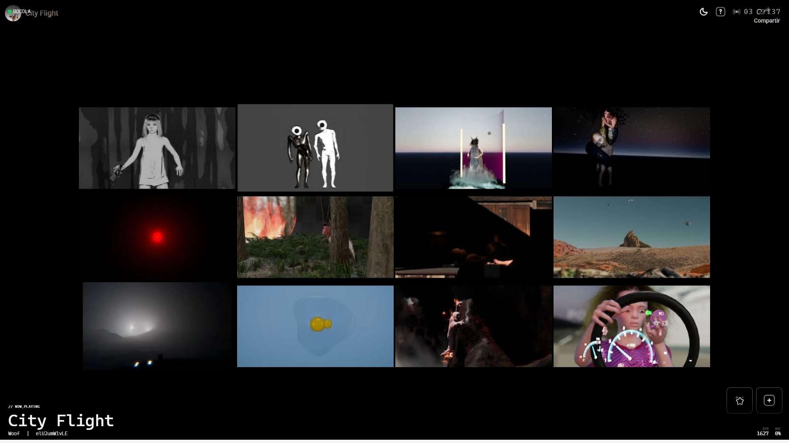
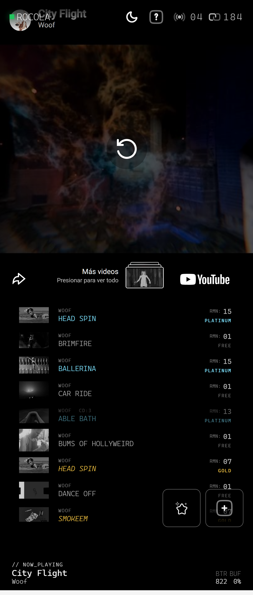

# Rocola (Minimal Jukebox)

A SvelteKit + Svelte 5 jukebox with Neon Postgres, Ably realtime sync, Stripe checkout, fair queue rotation, and shared playback timeline.

## Core Features
- Fair queue management (free + premium tiers, gap enforcement)
- YouTube iframe playback with shared timeline sync (`startedAtMs`)
- Realtime events (queue changes, song transitions, star reactions)
- Single active controller lease for authoritative playback control
- Autonomous server station tick (`/api/station/tick`) for no-client progression
- Admin/dev controls (seed, skip, clear)
- Help menu and keyboard shortcuts
- Installable PWA manifest with desktop/mobile screenshots
- Public station health dashboard at `/status` (`/api/status`)

## Playback Model
- Server + DB + Ably are authoritative for live station state.
- If queue is empty, station is idle.
- When a track is added, station starts and continues advancing until queue is exhausted (even with zero clients connected).
- In production, clients are passive observers for automatic transitions.
- In dev, controller tick fallback remains enabled for rapid local iteration.

## Screenshots
### Desktop


### Mobile


## Install (PWA)
- Open Rocola in Chrome/Edge.
- Use browser install action (`Install app` / `Add to Home Screen`).
- App metadata comes from `static/manifest.webmanifest` (includes desktop + mobile screenshots).

## Quick Start
1. Install dependencies:
```powershell
npm install
```
2. Start dev server:
```powershell
npm run dev
```
3. Open `http://localhost:5173`

## Vercel Cron Setup (for 24/7 station mode)
When deploying to Vercel, schedule autonomous ticks so playback advances without connected clients.

1. Set both `STATION_TICK_SECRET` and `CRON_SECRET` to the same value in Vercel env vars.
2. Add a cron job in `vercel.json`:
```json
{
  "crons": [
    { "path": "/api/station/tick", "schedule": "*/1 * * * *" }
  ]
}
```
3. Vercel Cron sends:
- `Authorization: Bearer <CRON_SECRET>`
The endpoint accepts Bearer tokens, so matching `CRON_SECRET` and `STATION_TICK_SECRET` authorizes cron ticks.

Notes:
- Local dev does not require cron; you can trigger manually with `POST /api/station/tick`.
- In production, keep the endpoint secret mandatory.

## Operator Shortcuts (Dev/Admin)
- `H` - toggle help menu
- `N` - skip to next song (dev/admin only)
- `Up Up Down Down Left Right Left Right A B` - enable admin mode

## Environment
- `DATABASE_URL` - Neon Postgres connection string
- `ABLY_SUPER_API_KEY` - Ably key for token issuance / publish path
- `STRIPE_SECRET_KEY` / `STRIPE_WEBHOOK_SECRET` - Stripe backend
- `YOUTUBE_API_KEY` - optional metadata enrichment
- `STATION_TICK_SECRET` - shared secret for internal station tick endpoint (`/api/station/tick`)
- `NODE_ENV` - dev/prod behavior gates

## Scripts
- `npm run dev` - start dev server
- `npm run check` - svelte check
- `npm run db:push` - apply Drizzle schema changes
- `npm run test` - vitest suite
- `npm run test:integration` - integration tests (expects running server)
- `npm run test:e2e` - playwright e2e (browser install required)
- `npm run pwa:screenshots` - capture seeded desktop/mobile screenshots for manifest
- `npm run pwa:icons` - generate PNG app icons (including maskable variants)
- `npm run preflight:check` - env/config sanity check (loads `.env` if present)

## Tests
- Unit tests cover queue routes/services, security, checkout completion, playback precision, star route, shortcuts.
- Integration tests cover queue/current payload behavior, queue-next response shape, and dev duplicate bypass behavior.

Integration test options:
- Default: start app separately, then run `npm run test:integration`
- Auto-start mode:
```powershell
$env:INTEGRATION_START_SERVER = "1"
npm run test:integration
```

## Notes
- In dev/admin mode, free-tier daily duplicate restriction is bypassed by design.
- Realtime playback synchronization now uses millisecond precision where available.
- Only the active admin controller can execute playback-control actions (`next`, unavailability marking).
- Controller lease is persisted in DB (`controller_lease`) and renewed via `/api/admin/controller`.
- Autonomous station mode is active via `station_runtime` + `POST /api/station/tick`.
- Playback self-healing reconciles stale pointers to queue head/idle to avoid stuck loops.
- Ops runbook: `docs/runbook-station-recovery.md`
- Test harness endpoint (dev/admin only): `POST /api/debug/controller` for deterministic controller lease claiming in E2E.
